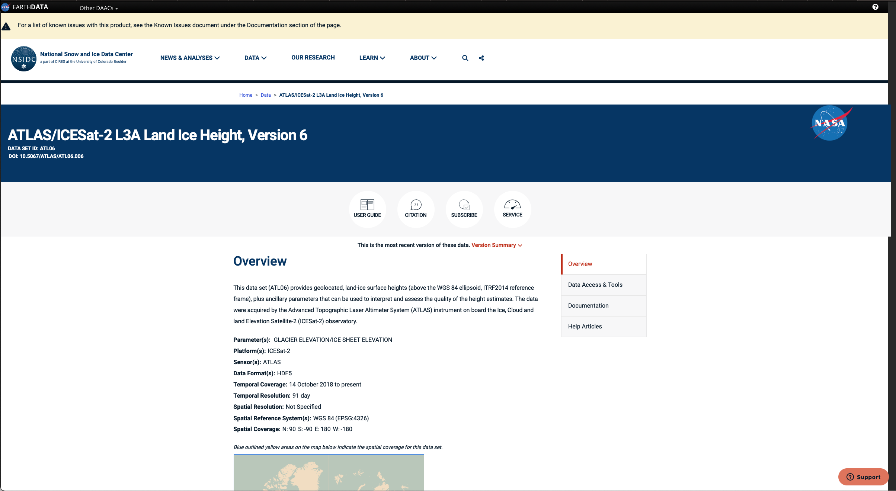
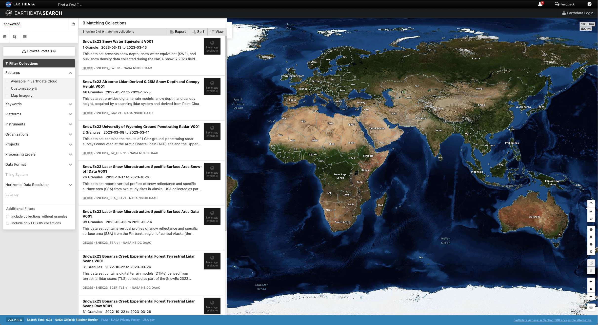

# Exploring NSIDC DAAC resources

## Learning Objectives

Explore various resources for learning about and accessing ICESat-2, SnowEx, and other NASA Earthdata.

Credits: Mikala Beig, Gail Reckase, and the NSIDC DAAC Data Use and Education Team
___

Reach out to us with data discovery and access questions!  Real people read the emails sent to nsidc@nsidc.org.  We are here to help make sure you get the data you need for your analysis.
___

## NASA National Snow and Ice Data Center Distributed Active Archive Center (NSIDC DAAC)

[The National Snow and Ice Data Center](https://nsidc.org) provides over 1100 data sets covering the Earth's cryosphere and more, all of which are available to the public free of charge. Beyond providing these data, NSIDC creates tools for data access, supports data users, performs scientific research, and educates the public about the cryosphere. 

   
## Data set documentation, tools, and services at nsidc.org:

* [The NSIDC ICESat-2 home page](https://nsidc.org/data/icesat-2) provides an overview of the data products and available user resources. 
    * Associated access, visualization, and data customization tools and services are provided on the [ICESat-2 Tools page](https://nsidc.org/data/icesat-2/tools).
* [The NSIDC SnowEx home page](https://nsidc.org/data/snowex) provides an overview of the data products and available user resources. 
    * Associated access, visualization, and data customization tools and services are provided on the [SnowEx Tools page](https://nsidc.org/data/snowex/tools).
* Landing pages: Each data set has an associated landing page with citation information, a curated user guide, and support documentation.
    * [ATL06 landing page](https://nsidc.org/data/atl06)
    * [SNEX23_MAR22_SD landing page](https://nsidc.org/data/snex23_mar22_sd)

## Data Exploration in Earthdata Search

https://search.earthdata.nasa.gov/search

Earthdata Search provides a graphical user interface for discovery of NASA data, and ordering and downloading data from its various archive locations. Earthdata Search leverages NASA's [Common Metadata Repository]( https://cmr.earthdata.nasa.gov/search/site/docs/search/api.html) (CMR), a high-performance, high-quality, continuously evolving metadata system that catalogs Earth Science data and associated service metadata records. These metadata records are registered, modified, discovered, and accessed through programmatic interfaces leveraging standard protocols and APIs.

Key Functions of Earthdata Search:
1. Web mapping interface for discovering and visualizing NASA Earthdata using spatial and temporal filters.
2. Customization services, including spatial subsetting, reformatting, and reprojection for *some* datasets.
3. Data ordering and downloading.

## ICESat-2 Data Exploration in OpenAltimetry

https://openaltimetry.earthdatacloud.nasa.gov/data/

OpenAltimetry is a cyberinfrastructure platform for discovery, access, and visualization of data from NASA’s ICESat and ICESat-2 missions. The unique data from these missions require a new paradigm for data access and discovery. OpenAltimetry addresses the needs of a diverse scientific community and increases the accessibility and utility of these data for new users. OpenAltimetry is a NASA funded collaborative project between the Scripps Institution of Oceanography, San Diego Supercomputer Center, National Snow and Ice Data Center, and UNAVCO.

Key Functions of OpenAltimetry:
1. Ground track filtering and visualization
2. On-the-fly plotting of segment elevations and photon clouds based on date and region of interest
3. Access data in CSV or subsetted HDF5 format
4. Plot and analyze photon data from your area of interest using a Jupyter Notebook

OpenAltimetry tutorials:
    
[Presentation on ICESat-2 and OpenAltimetry](https://www.youtube.com/watch?v=gfOGz8kk4VI) by NASA science education team.

[OpenAltimetry Tutorial](https://www.youtube.com/watch?v=ZanKXh1oQYc)  by Walt Meier, NSIDC DAAC Scientist.

## Data Exploration using the SnowEx SQL Database

GitHub repository:  https://github.com/SnowEx/snowexsql

## Hackweek Project: SnowEx Data Set Mapping Tool
SnowEx project lead by Jesslyn Di Fiori, NSIDC. This project aims to build a map-based web tool for cross-referencing SnowEx data sets.
