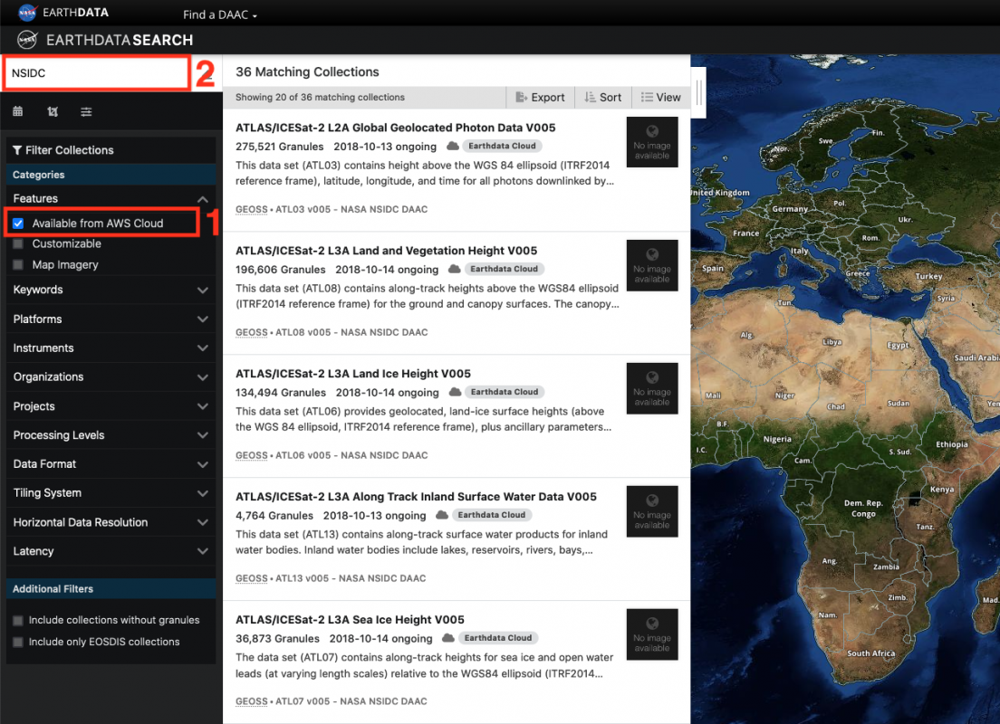
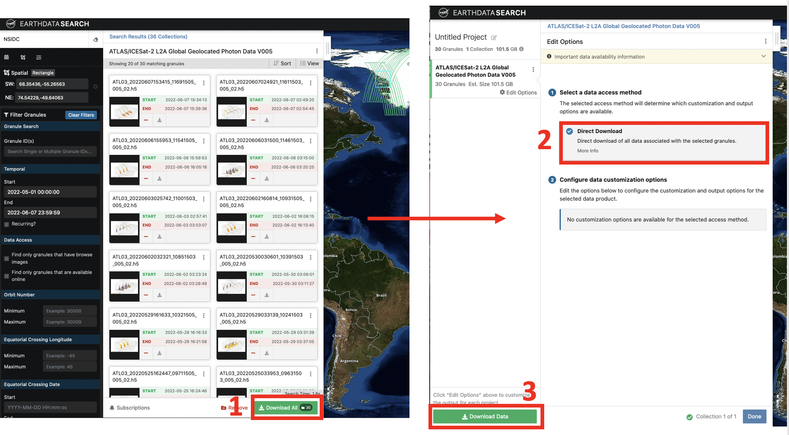
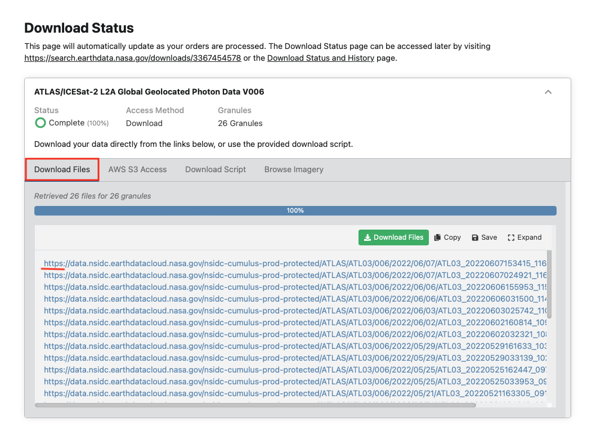
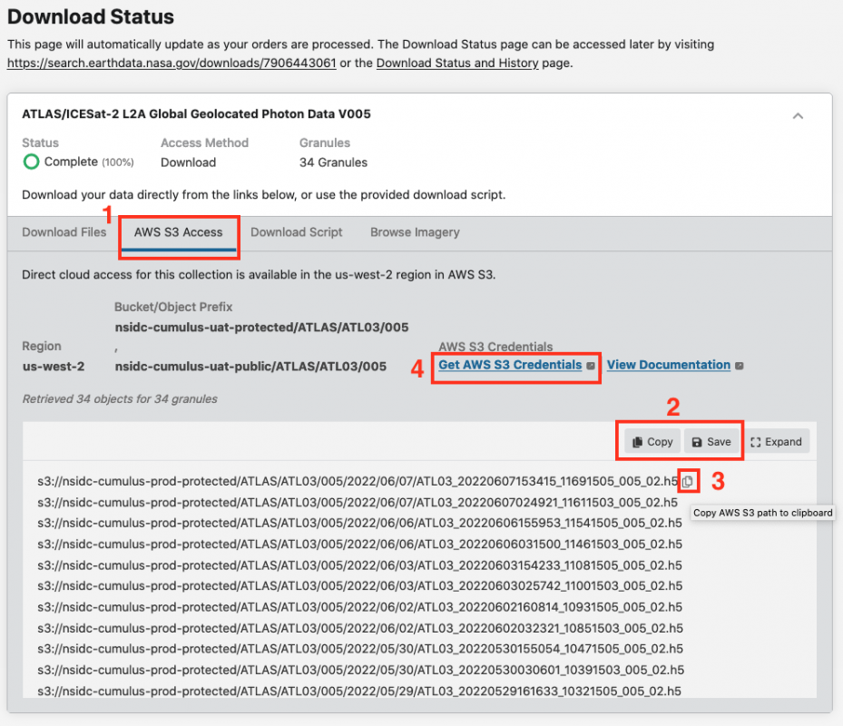

# Using NASA Earthdata Search to Discover Data

## Learning Objective

In this tutorial you will learn how to:

- discover and download DAAC server hosted datasets using NASA Earthdata Search.
- discover cloud-hosted datasets using NASA Earthdata Search.  
- get AWS S3 credentials so you can access Earthdata data
- get the S3 links to data granules

## Prerequisites

- an Earthdata Login

## Overview

NASA Earthdata Search is a web-based tool to discover, filter, visualize and access all of NASA's Earth science data, both in Earthdata Cloud and archived at the NASA DAACs.  It is a useful first step in data discovery, especially if you are not sure what data is available for your research problem.

## Searching for and downloading NASA DAAC server hosted data using Earthdata Search

Follow the instructions in this NSIDC help article:  [Search, Order, and Customize NSIDC DAAC Data Using NASA Earthdata Search](https://nsidc.org/data/user-resources/help-center/search-order-and-customize-nsidc-daac-data-nasa-earthdata-search).

## Searching for cloud-hosted data using Earthdata Search

### Search for Data

Step 1.  Go to https://search.earthdata.nasa.gov and log in using your Earthdata Login credentials by clicking on the Earthdata Login button in the top-right corner.

Step 2.  Check the **Available in Earthdata Cloud** box in the **Filter Collections** side-bar on the left of the page (Box 1 on the screenshot below).  The Matching Collections will appear in the results box.  All datasets in Earthdata Cloud have a badge showing a cloud symbol and "Earthdata Cloud" next to them.  To narrow the search, we will filter by datasets supported by NSIDC, by typing NSIDC in the search box (Box 2 on the screen shot below).  If you wanted, you could narrow the search further using spatial and temporal filters, or any of the other filters in the filter collections box.

Step 3. You can now select the dataset you want by clicking on that dataset.  The Search Results box now contains granules that match you search.  The location of these granules is shown on the map.  The search can be refined using spatial and temporal filters or you can select individual granules using the "+" symbol on each granule search result.  Once you have the data you want, click the **Download All** (Box 1 in the screenshot below).  In the sidebar that appears, select **Direct Download** (Box 2 in the screenshot below).  Then select **Download Data**.

### Getting https download urls, S3 links, and AWS S3 Credentials

Step 4.  A Download Status window will appear (this may take a short amount of time) similar to the one shown below. NASA will continue to support free download of data via https links.  Simply click the https link to initiate a single file download, click the "Download Files" button to download the entire list, or go to the Download Script tab and use the provided download script.

Step 5.  For direct S3 access, you will need the S3 object links.  You will see a tab for **AWS S3 Access** (Box 1 in the screenshot below).  Select this tab.  A list of S3 links starting with `s3://` will be in the box below.  You can save them to a text file or copy them to your clipboard using the **Save** and **Copy** buttons (Box 2 in the screenshot below).  Or you can copy each link separately by hovering over a link and clicking the clipboard icon (Box 3).

Step 6.  For direct S3 access to data in Earthdata Cloud, you need AWS S3 credentials; “accessKeyId”, “secretAccessKey”, and “sessionToken”.  These are temporary credentials that last for one hour.  To get them click on the **Get AWS S3 Credentials** (Box 4 in the screenshot below).   This will open a new page that contains the three credentials.  

You now have the information you need to access data in NASA Earthdata Cloud.

## Next up!  Using the earthaccess Python library to access data.  
earthaccess can access data from NASA DAAC servers, as well as NASA Earthdata Cloud, and *you don't need to worry about S3 links or credentials - it's all handled for you.*

